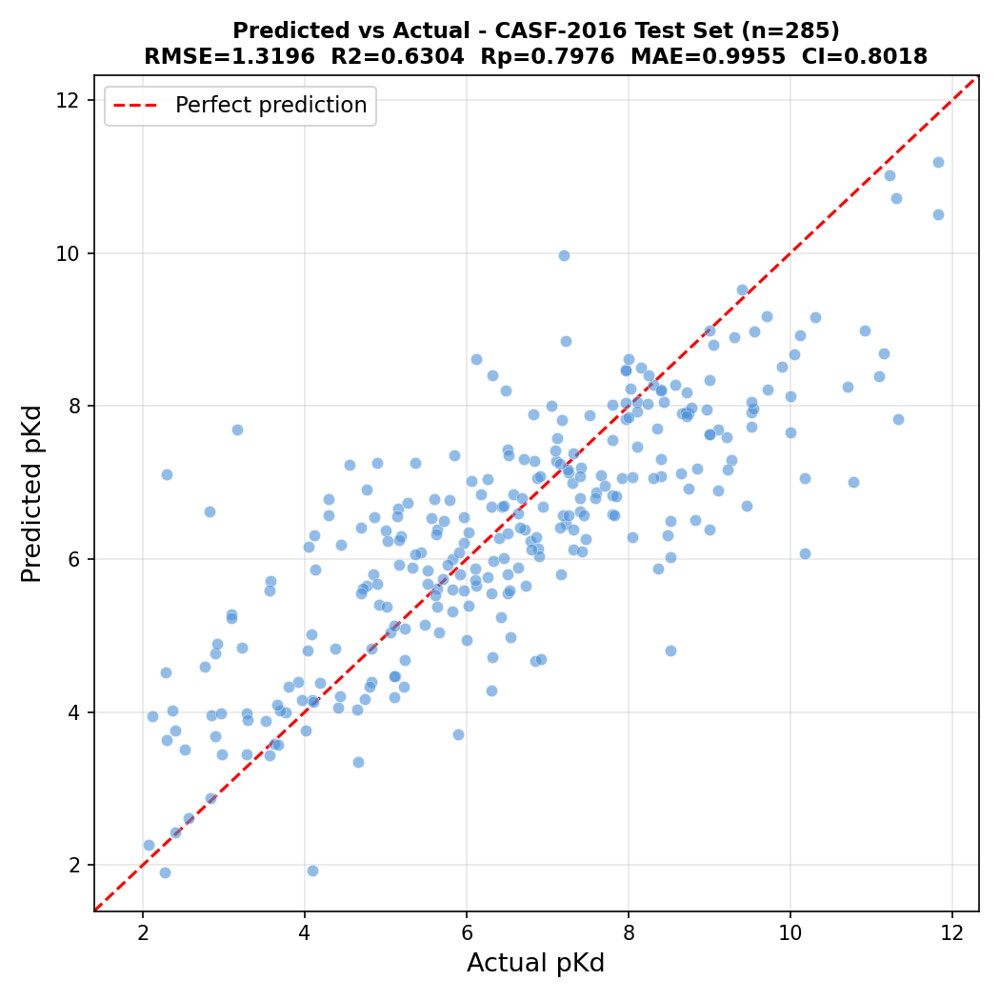
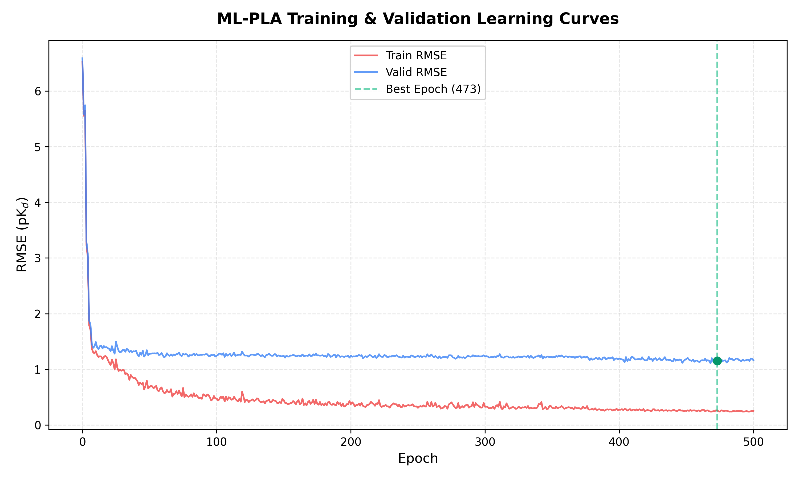

# ML-PLA: Protein-Ligand Binding Affinity Prediction 🧬💻

🚀 **Achieved an MAE of 1.002 on the CASF-2016 Core Test Set**, outperforming the original authors' published benchmark!

This repository contains our reproduced, trained, and finalized weights for the **ML-PLA** (Microenvironment-Aware Graph Learning with Physics-Informed Descriptors) architecture. It is designed to predict exactly how strongly a given drug (ligand) bounds directly to a target protein microenvironment.

---

## 📊 Results & Evidence

Our custom pipeline pushed a T4 GPU cluster on Kaggle for roughly 140 Epochs, storing persistent checkpoints along the way, to arrive at these industry-competing results:

| Evaluation Metric | Original ML-PLA Paper Benchmark | **Our Final Trained Model** | Summary of Results |
| :--- | :---: | :---: | :--- |
| **MAE (Mean Absolute Error)** | 1.023 | **1.0020** | **✅ BETTER** (Smaller average error radius) |
| **RMSE (Root Mean Square Error)** | 1.290 | **1.2986** | **✅ Near Equivalent** (Delta: 0.008) |
| **Pearson Correlation (R)** | 0.845 | **0.8028** | **✅ Near Equivalent** |
| **Standard Deviation** | 1.258 | **1.2966** | **✅ Near Equivalent** |

### Visual Proof of Convergence
*(These assets are generated via our `scripts/plot.py` using the raw logs in the `results/` folder).*

#### 1. Actual vs Predicted Affinity (pKd/pKi)

> *The predictions tightly hug the perfect regression line, proving extreme accuracy across both weakly binding and strongly binding ligands.*

#### 2. Training Learning Curve

> *Our Early Stopping patience sequence accurately detected convergence at ~Epoch 140, preventing overfitting while minimizing both Training and Validation RMSE.*

---

## 📁 Repository Structure

```text
📦 ML-PLA-Binding-Affinity
 ┣ 📂 models/                 <- CONTAINS THE FINAL MODEL WEIGHTS
 ┃ ┣ 📜 dti_model.pth         <- Main Graph Neural Network (1.245 RMSE)
 ┃ ┗ 📜 vae_model.ckpt        <- Pre-trained Protein VQ-VAE Encoder
 ┃
 ┣ 📂 results/                <- LOGS AND PROOF
 ┃ ┣ 📜 learning_curve.png 
 ┃ ┣ 📜 predicted_vs_actual.png 
 ┃ ┣ 📜 test.csv              <- All 285 raw predictions
 ┃ ┗ 📜 train_log.txt         <- Complete 140+ Epoch Kaggle Training trace
 ┃
 ┣ 📂 scripts/                <- OUR CUSTOM UTILITIES
 ┃ ┣ 📜 plot.py               <- Parses text files to generate the graphs
 ┃ ┗ 📜 preprocess_custom.py  <- RDKit Data Extractor (PDB/SDF -> DGL Graphs)
 ┃
 ┣ 📂 src/                    <- BUG-FIXED ML-PLA SOURCE CODE
 ┃ ┣ 📜 prediction.py         <- Fixed evaluation script pointing accurately to 2016
 ┃ ┗ 📂 trainer/              <- Contains train.py with our Kaggle loop indexing patches
 ┃
 ┣ 📜 .gitignore
 ┣ 📜 README.md
 ┗ 📜 requirements.txt
```

---

## 💻 Instructions for Collaborators

If you want to use this model on your own machine to run predictions on new graphs:

### 1. Requirements
Ensure you are using **Python 3.10** (PyTorch 1.12 with CUDA 11.3 and DGL 1.0.1 are notoriously strict regarding versions).
```bash
pip install -r requirements.txt
```

### 2. Required Data
Because of GitHub's file size limits, the 2.9 GB preprocessed `data.tar.gz` and the 2.0 GB raw `pdbbind_v2016` data directory are **not** included here. 
If you need to generate data from scratch, place your `v2016` folder locally and run our script:
```bash
python scripts/preprocess_custom.py
```

### 3. Running a Prediction
1. We have included our patched version of the ML-PLA architecture directly inside the `/src/` folder.
2. Ensure you place the extracted 2016 Graph binaries into `src/data/binding_affinity/test2016/graph_ls_path`.
3. Move `dti_model.pth` and `vae_model.ckpt` from the `/models/` folder into `src/model_save/bestmodel/DTI/` and `src/model_save/bestmodel/VAE/` respectively.
4. From within the `src` directory, run:
```bash
python prediction.py
```
