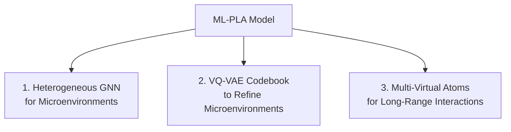
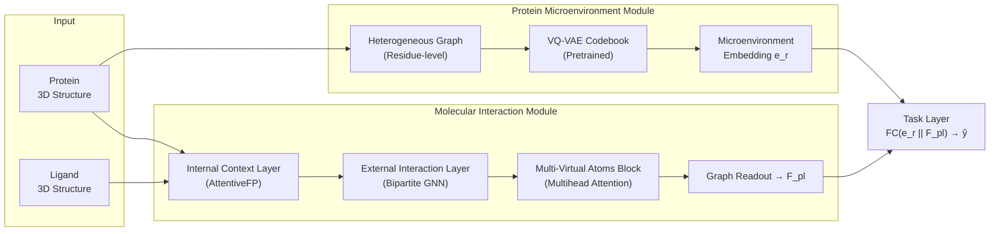

# ML-PLA: Detailed Explanation & Complete Project Workflow

> **Paper**: *ML-PLA: Enhancing Protein-Ligand Binding Affinity Prediction with Microenvironment and Long-Range Interaction-Aware Graph Neural Networks*  
> **Published**: J. Chem. Inf. Model. 2025, 65, 10988–10998  
> **Authors**: Yajie Meng, Zhuang Zhang, Jincan Li et al.  
> **Code**: [github.com/Biowust/ML-PLA](https://github.com/Biowust/ML-PLA)  
> **Report**: Team-3 (Maharshi, Gokul, Maithreya) — NIT Karnataka

---

## Part 1 — What Is This Paper About? (The Big Picture)

### The Core Problem
In **drug discovery**, a drug molecule (called a **ligand**) must bind tightly to a **protein target** in the body to be effective. The strength of this binding is called **binding affinity** (measured as pKa, pKd, or pIC50). Experimentally measuring affinity for millions of candidate molecules is extremely expensive and takes 12–15 years per drug.

**Goal**: Build a machine learning model that takes a protein–ligand complex as input and predicts the binding affinity value (a single number) — a **regression task**.

### Why Existing Methods Fall Short
| Limitation | Explanation |
|---|---|
| **Shallow microenvironment fusion** | Prior GNN models concatenate sequence and structure features of protein residues in a naive way, failing to capture their synergistic effects |
| **Fixed distance threshold** | Models only consider atoms within e.g. 5 Å, inherently missing important **long-range** biological interactions |
| **Oversmoothing** | Simply stacking more GNN layers to capture long-range info makes all node features converge to the same value |

### ML-PLA's Three Key Innovations



---

## Part 2 — Architecture Deep Dive

### 2.1 Overall Pipeline



The model produces a **single scalar** ŷ = predicted binding affinity.

---

### 2.2 Protein Microenvironment Module

#### What Is a Microenvironment?
The **microenvironment** of a residue is the chemical and geometric context created by its surrounding residues — both in sequence (nearby in the chain) and in 3D space (nearby in folded structure). This determines how the residue participates in binding.

#### Step A: Build a Residue-Level Heterogeneous Graph (𝒢_r)
- **Nodes**: Cα atoms of each of the M amino acid residues
- **Three edge types** (hence "heterogeneous"):
  1. **Sequential edges** — connect residues adjacent in the amino acid sequence
  2. **Radius edges** — connect residues within a Euclidean distance d_r
  3. **K-nearest edges** — each residue connects to its K closest spatial neighbors
- A **Heterogeneous GNN (HGNN)** performs message passing over all three edge types simultaneously, producing residue embeddings h_i that encode both sequence context and structural context

#### Step B: Pretrain a Microenvironment Codebook via VQ-VAE + Masked Modeling
Traditional categories of microenvironments (e.g. hydrophobic, polar, etc.) are too coarse. ML-PLA learns a **discrete codebook** of fine-grained microenvironment types:

1. **Encoder** (the same HGNN) maps each residue → continuous latent vector z_e(x)
2. **Vector Quantization**: z_e(x) is snapped to the **nearest codebook vector** e_k, producing z_q(x)
3. **Decoder** (another HGNN) reconstructs the original input from z_q(x)

**Loss function** during pretraining has 3 components:
- **ℒ_rec** — reconstruction error: ||x − x̂||²
- **ℒ_e** — codebook alignment + commitment loss (with stop-gradient to decouple encoder/codebook updates)
- **ℒ_m** — **masked modeling loss**: some codebook entries are zeroed out; the model must still reconstruct from partial information → forces richer, more redundant codebook entries

> **Total pretraining loss**: ℒ_Pre = ℒ_rec + ℒ_e + η·ℒ_m

#### Step C: Get Protein Microenvironment Embedding
At inference, for each residue node h_i from the HGNN:
1. Look up its nearest codebook vector e_i via vector quantization
2. Concatenate: h_i ∥ e_i
3. Apply a **ReadOut** (e.g., sum/mean pooling) across all residues → graph-level embedding **e_r**

---

### 2.3 Molecular Interaction Module

#### Step A: Build Graphs
Three atom-level graphs are constructed from the protein–ligand complex:
- **𝒢_p** — protein atom graph (intramolecular)
- **𝒢_l** — ligand atom graph (intramolecular)
- **𝒢_pl** — protein–ligand **bipartite graph** (intermolecular, edges for atom pairs within **5 Å**)

#### Step B: Internal Context Layer (AttentiveFP)
Processes 𝒢_p and 𝒢_l independently to learn atom embeddings capturing intramolecular properties:
- Uses **graph attention** (LeakyReLU + softmax) to compute attention scores α_ij between bonded atoms
- A **GRU** (Gated Recurrent Unit) updates node features across layers
- **Skip connections** across all layers mitigate oversmoothing
- Output: h_i^final for each protein/ligand atom

#### Step C: External Interaction Layer
On the bipartite graph 𝒢_pl, a GCN-like convolution passes messages between protein and ligand atoms:

> H_i^(l) = W₁·H_i^(l-1) + W₂·Mean(H_j^(l-1)) for j ∈ neighbors of i

This integrates intermolecular interaction information into each atom's representation.

#### Step D: Multi-Virtual Atoms Block (Key Innovation)

> [!IMPORTANT]
> This is the paper's most novel contribution — it solves the long-range interaction problem **without** adding more GNN layers (which would cause oversmoothing).

The idea (inspired by "Neural Atoms" from ICLR 2024):

1. **Project** all N atom features into **v virtual atoms** using a learnable matrix Q_va ∈ ℝ^(v×d):
   - H_va = LN(Q_va ⊕ MHA(Q_va, H_i, H_i))
2. **Virtual atoms attend to each other** via multihead attention:
   - Ĥ_va = LN(H_va ⊕ MHA(H_va, H_va, H_va))
3. **Back-project** virtual atoms back to original atoms:
   - F_i = H_i + A_va · Ĥ_va  (A_va is the aggregated allocation matrix)

**Why this works**: The virtual atoms act as a **communication channel**. Every real atom sends info to virtual atoms; virtual atoms talk to each other (capturing long-range dependencies); then info flows back. This is equivalent to all-pairs interaction but with much lower cost — O(N·v) instead of O(N²).

**Number of virtual atoms**: Best results at **v = 25** (~12% of average atom count).

#### Step E: Graph Readout
Concatenate node features with edge features (Euclidean distances), then apply ReadOut to get the complex-level representation **F_pl**.

---

### 2.4 Task Layer (Prediction Head)
Simply concatenates the two representations and passes through a fully connected network:

> ŷ = BN(FCNN(e_r ∥ F_pl))

Output: predicted binding affinity (single scalar, in pKa units).

---

### 2.5 Training Details
| Parameter | Value |
|---|---|
| **Training set** | PDBBind-2016 general set: 11,904 samples |
| **Validation set** | 1,000 samples |
| **Test sets** | CASF-2016 (285), CASF-2013 (107), CSAR-HiQ (176+167), Holdout2019 (4,366) |
| **Distance threshold** | 5 Å |
| **Virtual atoms** | 25 |
| **VQ-VAE pretraining** | 50 epochs, ~19.65 s/epoch, 5 GB GPU |
| **Inference speed** | ~1.77 ms/sample |

---

## Part 3 — Results Summary

### Main Benchmark (CASF-2016)
| Metric | ML-PLA | Best Baseline (CL-GNN) |
|---|---|---|
| Pearson R ↑ | **0.845** | 0.842 |
| RMSE ↓ | **1.179** | 1.191 |
| MAE ↓ | **0.892** | 0.956 |

### Key Ablation Findings
- Removing the **codebook** (w/o C) → performance drops, showing the VQ-VAE refined features matter
- Removing **virtual atoms** (w/o V) → significant degradation, confirming long-range capture is essential
- Removing **both microenvironment and codebook** (w/o M&C) → worst overall, proving the microenvironment module is foundational

---

## Part 4 — Your Team's Report Extension (MISATO Integration)

Your report proposes enhancing ML-PLA by adding features from the **MISATO dataset**:
1. **Quantum Mechanical (QM) Features**: partial charges, electron affinity, polarizability → better electrostatic modeling
2. **Molecular Dynamics (MD) Features**: RMSF (root mean square fluctuation) → captures protein flexibility

These would be incorporated as **additional node features** in the graph construction step.

---

## Part 5 — Complete Project Workflow (From Zero)

### Phase 0: Environment Setup

```
# 1. Install Miniconda (if not already)
# Download from https://docs.conda.io/en/latest/miniconda.html

# 2. Create a dedicated conda environment
conda create -n mlpla python=3.9 -y
conda activate mlpla

# 3. Install PyTorch with CUDA 11.3
pip install torch==1.12.1+cu113 -f https://download.pytorch.org/whl/torch_stable.html

# 4. Install DGL (Deep Graph Library)
pip install dgl==1.0.1+cu113 -f https://data.dgl.ai/wheels/cu113/repo.html
pip install dgllife==0.3.2

# 5. Install other scientific dependencies
pip install numpy pandas scikit-learn scipy rdkit-pypi biopython
pip install matplotlib seaborn  # for visualization

# 6. Clone the official repository
git clone https://github.com/Biowust/ML-PLA.git
cd ML-PLA
```

---

### Phase 1: Data Acquisition & Understanding

#### Step 1.1 — Download PDBBind Dataset
- Go to [PDBBind](http://www.pdbbind.org.cn/) or the [PaddleHelix mirror](https://github.com/PaddlePaddle/PaddleHelix/tree/dev/apps/drug_target_interaction/sign)
- Download the **PDBBind v2016 general set** (~13,285 protein–ligand complexes)
- Each complex contains:
  - `.pdb` file — protein 3D structure
  - `.mol2` or `.sdf` file — ligand 3D structure
  - Binding affinity label (Ki, Kd, or IC50 → converted to -log = pKa)

#### Step 1.2 — Download Processed Data (Shortcut)
- The authors provide preprocessed data at [Zenodo](https://zenodo.org/records/15321538)
- Place downloaded files in `./data/`

#### Step 1.3 — Understand What a Complex Looks Like
```
PDBBind/
├── 1a1e/          # PDB ID
│   ├── 1a1e_protein.pdb    # protein structure
│   ├── 1a1e_ligand.mol2    # ligand structure
│   └── 1a1e_pocket.pdb     # binding pocket atoms
├── 1a28/
│   └── ...
└── index/
    └── INDEX_general_PL.2016   # affinity labels
```

---

### Phase 2: Data Preprocessing

```bash
python preprocess.py
```

This script does the following internally:

| Step | What It Does |
|---|---|
| **Parse structures** | Read `.pdb` and `.mol2` files using RDKit/BioPython |
| **Extract atom features** | Atom type, element, charge, hybridization, degree, etc. |
| **Extract residue features** | Amino acid type, secondary structure, position |
| **Build protein residue graph 𝒢_r** | Nodes = Cα atoms; edges = sequential + radius + KNN |
| **Build atom-level graphs** | 𝒢_p (protein atoms), 𝒢_l (ligand atoms), 𝒢_pl (bipartite, 5 Å threshold) |
| **Compute edge features** | Euclidean distances between connected atoms |
| **Train/val/test split** | 11,904 / 1,000 / 285 (CASF-2016) |

---

### Phase 3: Pretrain the Microenvironment Codebook

> [!NOTE]
> This is a **separate pretraining step** before the main model training.

**What happens**:
1. Build residue-level heterogeneous graphs for all proteins
2. Train a VQ-VAE with masked modeling:
   - **Encoder** (HGNN): residue → continuous latent z_e
   - **Vector quantization**: snap z_e to nearest codebook entry
   - **Decoder** (HGNN): reconstruct from quantized representation
   - **Masking**: randomly zero out codebook entries and require reconstruction
3. Save the trained **codebook** (a lookup table of |ε| vectors, each of dimension D)

**Duration**: ~50 epochs, ~19.65 s/epoch, ~5 GB GPU memory.

---

### Phase 4: Train the Full ML-PLA Model

```bash
python trainer/train.py
```

**Training loop** (each epoch):

```
For each protein-ligand complex in training set:
    1. Load preprocessed graphs (𝒢_r, 𝒢_p, 𝒢_l, 𝒢_pl)
    
    2. MICROENVIRONMENT MODULE
       a. Pass 𝒢_r through HGNN → residue embeddings h_i
       b. Look up pretrained codebook → microenvironment features e_i
       c. Concatenate h_i || e_i, ReadOut → e_r
    
    3. MOLECULAR INTERACTION MODULE
       a. Internal Context (AttentiveFP) on 𝒢_p and 𝒢_l → h_i^final
       b. External Interaction Layer on 𝒢_pl → H_i
       c. Multi-Virtual Atoms Block → F_i (long-range enriched)
       d. ReadOut → F_pl
    
    4. TASK LAYER
       Concatenate e_r || F_pl → FCNN → ŷ (predicted affinity)
    
    5. Compute loss: MSE(ŷ, y_true)
    6. Backpropagate and update weights
```

**Model selection**: Save the model with the **lowest validation error**.

---

### Phase 5: Evaluation

```bash
python prediction.py
```

**Metrics to compute**:

| Metric | Formula | Good Value |
|---|---|---|
| **Pearson R** | Correlation between predicted and true values | > 0.8 |
| **RMSE** | √(mean of squared errors) | < 1.3 |
| **MAE** | Mean of absolute errors | < 1.0 |
| **CI** (Concordance Index) | Fraction of correctly ranked pairs | > 0.8 |
| **SD** | Standard deviation of regression residuals | < 1.2 |

---

### Phase 6: Your Extension — MISATO Integration

#### Step 6.1 — Get MISATO Data
- Download from [MISATO dataset](https://zenodo.org/records/7711953)
- Contains QM properties (partial charges, electron affinity, polarizability) and MD trajectories (RMSF)

#### Step 6.2 — Feature Engineering
```python
# Pseudocode for adding QM/MD features
for each complex in dataset:
    if complex_id in MISATO:
        qm_features = load_qm(complex_id)       # [partial_charge, electron_affinity, polarizability]
        md_features = load_md(complex_id)         # [RMSF per atom]
        
        # Append to existing atom node features
        atom_features = concat(original_features, qm_features, md_features)
    else:
        # Use zero-padding or skip
        atom_features = concat(original_features, zeros(qm_dim + md_dim))
```

#### Step 6.3 — Modify the Model
- Update the **input feature dimension** in the Internal Context Layer to accommodate the extra QM/MD features
- Everything else stays the same

#### Step 6.4 — Ablation Studies
Train and evaluate four variants:
1. **Baseline ML-PLA** (original)
2. **ML-PLA + QM** (add quantum features only)
3. **ML-PLA + MD** (add dynamics features only)
4. **ML-PLA + QM + MD** (add both)

Compare using Pearson R, RMSE, Spearman ρ on CASF-2016.

---

### Phase 7: Visualization & Reporting

#### What to Plot
1. **Scatter plot**: predicted vs. true binding affinity (with regression line and R value)
2. **Ablation bar chart**: R and RMSE for each model variant
3. **Parameter sensitivity**: RMSE vs. distance threshold (3–8 Å), RMSE vs. number of virtual atoms (5–50)
4. **Training curves**: loss vs. epoch for train and validation

---

## Summary Checklist

| # | Task | Status |
|---|---|---|
| 1 | Set up environment (conda, PyTorch, DGL) | ☐ |
| 2 | Download PDBBind v2016 data | ☐ |
| 3 | Run preprocessing (`preprocess.py`) | ☐ |
| 4 | Pretrain VQ-VAE codebook | ☐ |
| 5 | Train ML-PLA model (`train.py`) | ☐ |
| 6 | Evaluate on CASF-2016/2013 (`prediction.py`) | ☐ |
| 7 | Download MISATO dataset | ☐ |
| 8 | Engineer QM + MD features | ☐ |
| 9 | Modify input dimensions in model code | ☐ |
| 10 | Run ablation experiments | ☐ |
| 11 | Generate visualizations and write report | ☐ |
